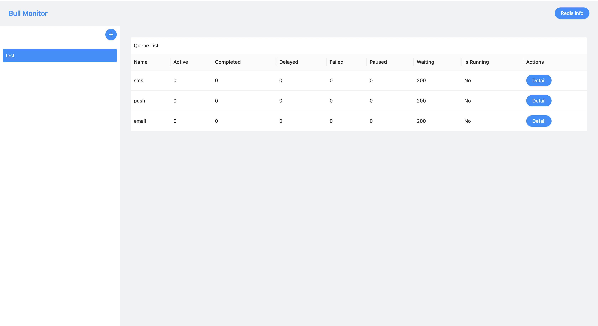
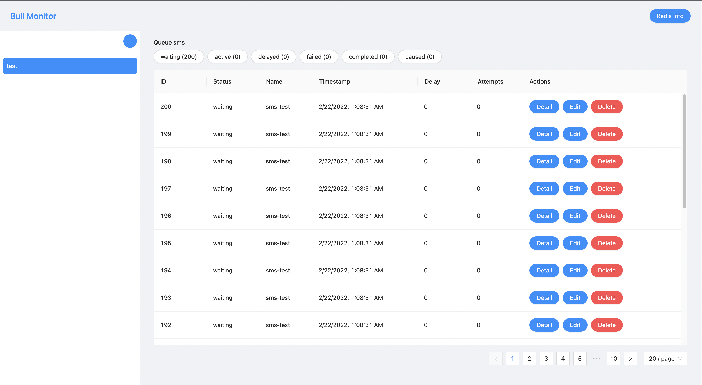
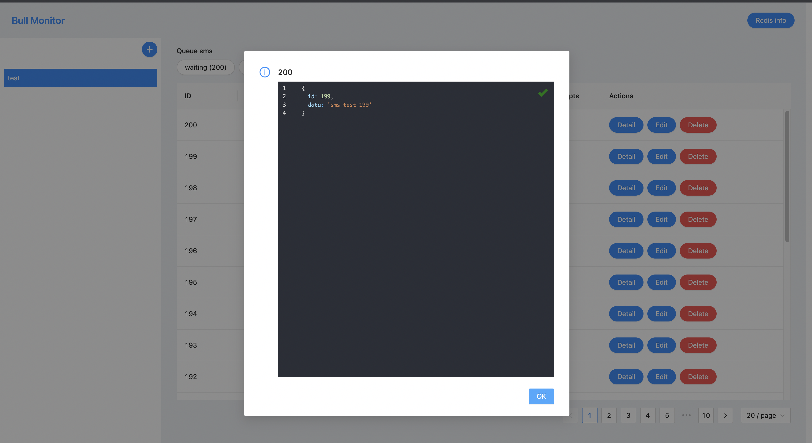
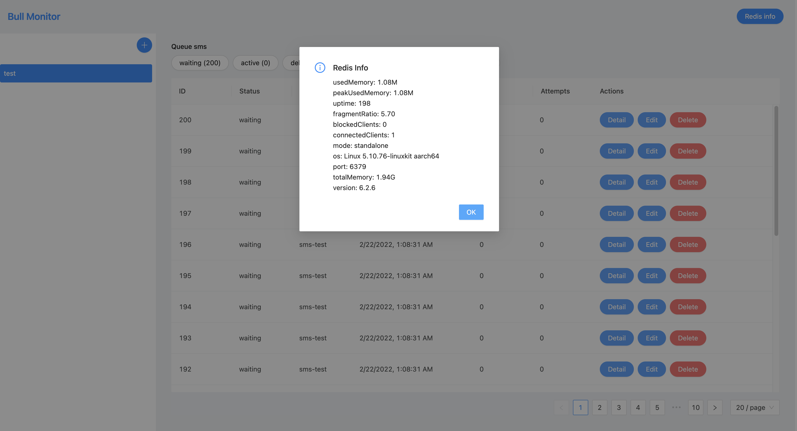

# Bull Monitor

Small utility to monitor the status of BullMQ.

## What's this for?

This helps you with monitoring the status of BullMQ queues and jobs.

### Main features

- add redis connection to view available queues
- see status of queues
- list jobs by queue and status
- view job data
- edit job data
- delete job
- retry failed job

### Screenshots

Overview



List job of queue



Job detail



Redis info



### Develop

#### Install

```
yarn
or
npm install
```

#### Run

```
npm run dev

# or

yarn dev
```
